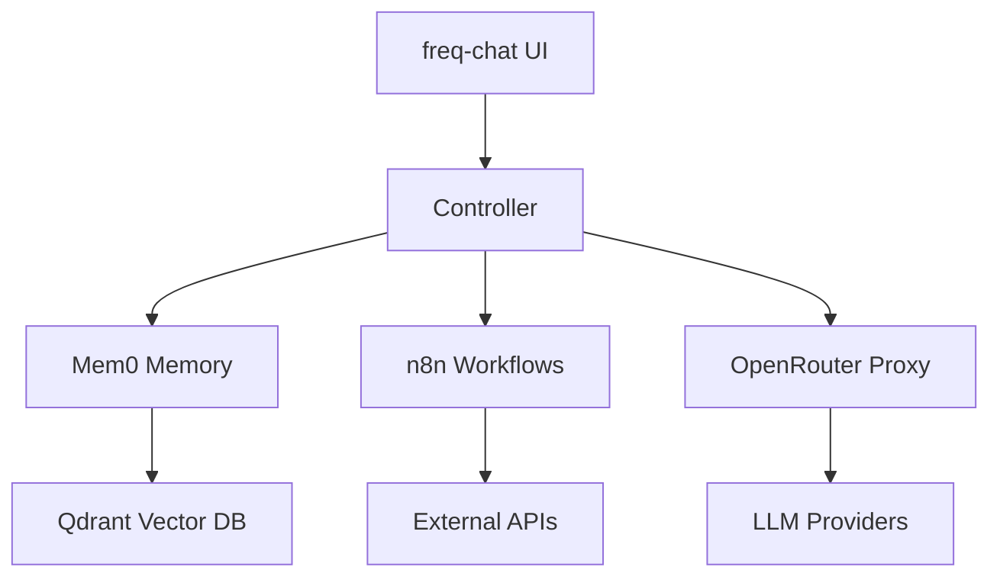

# 📚 Auto-Stack Documentation

> **Unified platform for AI-driven automation and algorithmic trading**

**Status:** Consolidated Documentation Structure - Phase 3 Implementation  
**Created:** 2025-01-26  
**Last Updated:** 2025-07-21  

---

## 🚀 Quick Start

**New to auto-stack?** Get up and running in minutes:

### Essential First Steps

1. **[📖 Quick Start Guide](setup/00_QuickStart.md)** - Complete setup in 15 minutes
2. **[🏗️ Service Architecture](architecture/services/README.md)** - Understand the system
3. **[🔗 Integration Patterns](architecture/integrations/README.md)** - Learn service interactions

---

## 📁 Documentation Structure

### 🛠️ Setup & Configuration

**Path:** `[setup/](setup/)`

| Document | Purpose | Status |
|----------|---------|--------|
| `00_QuickStart.md` | **Primary setup guide** | ✅ Complete |
| `01_Prerequisites.md` | System requirements | 📝 Planned |
| `02_Configuration.md` | Advanced configuration | 📝 Planned |

### 🏗️ Architecture & Design

**Path:** `[architecture/](architecture/)`

| Section | Purpose | Contents |
|---------|---------|----------|
| **`services/`** | Service documentation | API references, configurations |
| **`integrations/`** | Integration patterns | Communication protocols, workflows |
| **`api-contracts/`** | API specifications | OpenAPI specs, contracts |

### 🔧 Operations & Maintenance

**Path:** `[operations/](operations/)`

| Section | Purpose | Status |
|---------|---------|--------|
| **`development/`** | Development workflows | 📝 In Progress |
| **`deployment/`** | CI/CD procedures | 📝 Planned |
| **`troubleshooting/`** | Complete diagnostic & fix guides | ✅ Available |

### 📖 Reference & Guides

**Path:** `[reference/](reference/)`

| Section | Purpose | Contents |
|---------|---------|----------|
| **`guides/`** | Step-by-step tutorials | Detailed walkthroughs |
| **`templates/`** | Configuration examples | Ready-to-use configs |
| **`api/`** | API documentation | Complete API references |

### 📦 Historical Archive

**Path:** `[archive/](archive/)`

- **`triage_legacy/`** - Previous documentation versions
- **`depreciated/`** - Deprecated components and guides

---

## 🎯 Core Services Overview

### Primary Services

| Service | Purpose | Technology | Port | Status |
|---------|---------|------------|------|--------|
| **🎛️ Controller** | API Gateway & Orchestrator | Python, FastAPI | 5050 | ✅ Active |
| **🧠 Mem0** | Memory & Knowledge Management | Python, FastAPI | 8000 | ✅ Active |
| **🔄 n8n** | Workflow Automation | Node.js, TypeScript | 5678 | ✅ Active |
| **💬 freq-chat** | User Interface | Next.js, React | 3001 | ✅ Active |
| **🌐 Traefik** | Reverse Proxy | Go | 80, 443, 8081 | ✅ Active |

**📖 Detailed Documentation:** [Service Architecture Guide](architecture/services/README.md)

### Supporting Services

| Service | Purpose | Technology | Port | Status |
|---------|---------|------------|------|--------|
| **🔍 Qdrant** | Vector Database | Rust | 6333-6334 | ✅ Active |
| **🐘 PostgreSQL** | Structured Database | SQL | 5432 | ✅ Active |
| **🔗 OpenRouter Proxy** | LLM Gateway | Node.js | 8001 | ✅ Active |
| **🧠 BGE Embedding** | Text Embeddings | Python | 7861 | ✅ Active |
| **📈 Freqtrade** | Trading Platform | Python | 8080 | 🚧 Future |

---

## 🔗 Integration Architecture

### Communication Methods

| Method | Use Case | Implementation |
|--------|----------|----------------|
| **🌐 HTTP REST APIs** | Synchronous communication | Direct service-to-service calls |
| **🪝 Webhook Events** | Asynchronous events | Event-driven automation |
| **💾 Memory-Mediated** | Persistent state sharing | Via Mem0 service |

### Key Integration Points



**🔗 Integration Patterns:** [Detailed Integration Guide](architecture/integrations/README.md)

---

## ⚡ Quick Development Setup

### 1. Clone & Configure

```bash
# Clone repository
git clone <repo-url> auto-stack
cd auto-stack

# Configure environment
cp .env.example .env
# Edit .env with your API keys and settings
```

### 2. Start Services

```bash
# Start all services
docker compose up -d

# Verify deployment
curl http://localhost:5050/api/v1/status
```

### 3. Access Interfaces

- **💬 Chat Interface:** <http://localhost:3001>
- **🔄 Workflow Engine:** <http://localhost:5678>
- **🎛️ API Documentation:** <http://localhost:5050/docs>
- **🌐 Traefik Dashboard:** <http://localhost:8081>

---

## 📊 Health Monitoring

### Service Health Checks

| Service | Endpoint | Expected Response |
|---------|----------|-------------------|
| **Controller** | `GET /api/v1/status` | `{"status": "ok"}` |
| **Mem0** | `GET /status` | `{"status": "ok"}` |
| **n8n** | `GET /healthz` | `"OK"` |
| **Traefik** | `GET /ping` | `"OK"` |
| **freq-chat** | `GET /api/health` | `{"healthy": true}` |

### Quick Health Check

```bash
# Check all services at once
docker compose ps

# Individual service health
curl http://localhost:5050/api/v1/status    # Controller
curl http://localhost:8000/status           # Mem0
curl http://localhost:3001/api/health       # freq-chat
```

---

## 🚨 Troubleshooting Quick Reference

### Common Issues & Solutions

| Issue | Quick Fix | Documentation |
|-------|-----------|---------------|
| **Services won't start** | Check Docker Desktop + WSL2 | [Setup Guide](setup/00_QuickStart.md#troubleshooting) |
| **Network connectivity** | Verify `auto-stack-net` exists | [Operations Guide](operations/troubleshooting/) |
| **Authentication errors** | Check API keys in `.env` | [Configuration Guide](setup/00_QuickStart.md#environment-configuration) |
| **Port conflicts** | Check port availability | [Troubleshooting Guide](operations/troubleshooting/) |

### Emergency Commands

```bash
# View service logs
docker compose logs -f [service_name]

# Restart specific service
docker compose restart [service_name]

# Full stack restart
docker compose down && docker compose up -d

# Check network connectivity
docker network ls | grep auto-stack-net
```

---

## 🌐 External Resources

### Official Documentation

- **[Docker Compose Reference](https://docs.docker.com/compose/)** - Container orchestration
- **[Traefik Documentation](https://doc.traefik.io/traefik/)** - Reverse proxy configuration
- **[n8n Documentation](https://docs.n8n.io/)** - Workflow automation
- **[FastAPI Documentation](https://fastapi.tiangolo.com/)** - API framework

### Community & Support

- **🐛 Issues:** [GitHub Issues](https://github.com/your-repo/auto-stack/issues) for bug reports
- **💬 Discussions:** [GitHub Discussions](https://github.com/your-repo/auto-stack/discussions) for questions
- **🤝 Contributing:** See `CONTRIBUTING.md` for guidelines

---

## 📋 Documentation Maintenance

### Version Information

- **Documentation Version:** 3.0 (Post-Consolidation)
- **Consolidation Status:** ✅ Complete
- **Last Major Update:** 2025-07-01

### Consolidation Summary

This documentation structure **replaces and consolidates:**

| Before | After | Improvement |
|--------|-------|-------------|
| 3 overlapping setup guides | → 1 comprehensive quick start | 🎯 Single source of truth |
| 7 scattered service docs | → 1 unified architecture guide | 📚 Centralized knowledge |
| 5 integration guides | → 1 comprehensive integration reference | 🔗 Complete integration map |
| Multiple legacy folders | → Clean archive structure | 🗂️ Organized history |

### Navigation Guide

| Your Role | Start Here | Next Steps |
|-----------|------------|------------|
| **🆕 New User** | [Quick Start Guide](setup/00_QuickStart.md) | → Service Architecture |
| **👨‍💻 Developer** | [Service Architecture](architecture/services/README.md) | → Integration Patterns |
| **🔧 Integrator** | [Integration Patterns](architecture/integrations/README.md) | → API References |
| **🚨 Troubleshooter** | [Operations Guide](operations/troubleshooting/) | → Service Logs |

---

**🚀 Ready to get started?** Begin with the **[Quick Start Guide](setup/00_QuickStart.md)** and have your auto-stack running in minutes!
