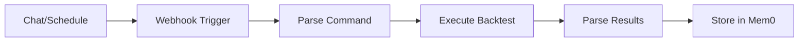
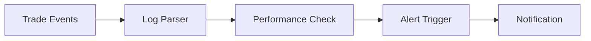
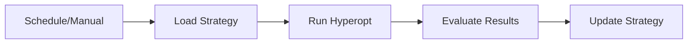

# 🔄 Freqtrade n8n Workflows

## Overview

This document describes the n8n workflows that automate Freqtrade operations, including backtesting, performance monitoring, and trade execution.

## Core Workflows

### 1. Backtest Runner

**File:** `Freqtrade_Task_Runner.json`

Purpose: Executes backtesting tasks triggered by the chat interface or scheduled events.



Configuration:

```json
{
    "name": "Freqtrade Task Runner",
    "nodes": [
        {
            "type": "n8n-nodes-base.webhook",
            "parameters": {
                "path": "backtest",
                "responseMode": "lastNode"
            }
        },
        {
            "type": "n8n-nodes-base.httpRequest",
            "parameters": {
                "url": "=http://controller:3000/api/v1/execute",
                "method": "POST",
                "authentication": "genericCredentialType"
            }
        }
    ]
}
```

### 2. Performance Monitor

**File:** `Freqtrade_Log_Monitor.json`

Purpose: Monitors trading performance and generates alerts.



Configuration:

```json
{
    "name": "Freqtrade Log Monitor",
    "nodes": [
        {
            "type": "n8n-nodes-base.readFile",
            "parameters": {
                "filePath": "/freqtrade/user_data/logs/freqtrade.log"
            }
        },
        {
            "type": "n8n-nodes-base.if",
            "parameters": {
                "conditions": {
                    "string": [
                        {
                            "value1": "={{$node.ReadFile.data.content}}",
                            "value2": "ERROR",
                            "operation": "contains"
                        }
                    ]
                }
            }
        }
    ]
}
```

### 3. Strategy Optimizer

**File:** `Strategy_Optimizer.json`

Purpose: Automates hyperparameter optimization for trading strategies.



Configuration:

```json
{
    "name": "Strategy Optimizer",
    "nodes": [
        {
            "type": "n8n-nodes-base.schedule",
            "parameters": {
                "cronExpression": "0 0 * * 0"
            }
        },
        {
            "type": "n8n-nodes-base.httpRequest",
            "parameters": {
                "url": "=http://controller:3000/api/v1/execute",
                "method": "POST",
                "body": {
                    "command": "hyperopt",
                    "strategy": "={{$node.Schedule.data.strategy}}",
                    "epochs": 100
                }
            }
        }
    ]
}
```

## Integration Points

### 1. Controller API

Base URL: `http://controller:3000/api/v1`

Endpoints:

- `POST /execute` - Execute Freqtrade commands
- `GET /status` - Get trading status
- `POST /notify` - Send notifications

### 2. Memory Service

Base URL: `http://mem0:8080`

Operations:

- Store backtest results
- Query trading history
- Track strategy evolution

### 3. Notification Service

Channels:

- Discord
- Email
- Telegram

## Environment Setup

Required environment variables:

```bash
# n8n Configuration
N8N_HOST=0.0.0.0
N8N_PORT=5678
N8N_PROTOCOL=http
N8N_WEBHOOK_URL=http://n8n:5678

# Integration
CONTROLLER_URL=http://controller:3000
MEM0_URL=http://mem0:8080

# Notifications
DISCORD_WEBHOOK_URL=your_webhook_url
TELEGRAM_BOT_TOKEN=your_bot_token
SMTP_CONFIG=your_smtp_config
```

## Development

### Local Testing

1. Start n8n:

   ```bash
   docker compose up -d n8n
   ```

2. Import workflows:

   ```bash
   n8n import:workflow --input workflows/
   ```

3. Test execution:

   ```bash
   curl -X POST http://localhost:5678/webhook/backtest \
        -H "Content-Type: application/json" \
        -d '{"strategy":"MyStrategy"}'
   ```

### Workflow Creation

1. Create new workflow:

   ```bash
   n8n create:workflow
   ```

2. Export workflow:

   ```bash
   n8n export:workflow --id 1 --output workflow.json
   ```

## Monitoring

### Health Checks

```bash
# Check n8n status
curl http://n8n:5678/health

# Check workflow execution
curl http://n8n:5678/api/v1/executions
```

### Logs

```bash
# View n8n logs
docker logs n8n

# Follow execution logs
docker logs -f n8n
```

## Troubleshooting

1. **Workflow Execution Issues**

   ```bash
   # Check execution history
   curl http://n8n:5678/api/v1/executions?status=error
   
   # View specific execution
   curl http://n8n:5678/api/v1/executions/:id
   ```

2. **Integration Problems**

   ```bash
   # Test Controller connection
   curl http://controller:3000/health
   
   # Test Mem0 connection
   curl http://mem0:8080/health
   ```

## Security

1. **Authentication**
   - Webhook authentication
   - API key validation
   - JWT token verification

2. **Network Security**
   - Internal network isolation
   - HTTPS for external access
   - Rate limiting

## Maintenance

1. **Backup**

   ```bash
   # Export all workflows
   n8n export:all --output backup/
   
   # Backup credentials
   n8n export:credentials --output backup/
   ```

2. **Updates**

   ```bash
   # Update n8n
   docker compose pull n8n
   docker compose up -d n8n
   
   # Verify workflows
   n8n update:workflows
   ```

## Additional Resources

- [n8n Documentation](https://docs.n8n.io/)
- [Workflow Templates](docs/architecture/services/n8n/templates/)
- [Integration Guide](docs/architecture/integrations/README.md)
