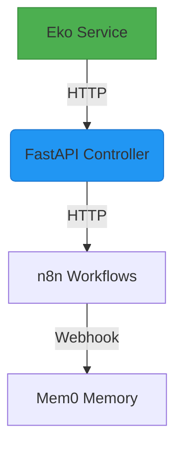

# EKO Service Tasklist

This document consolidates all EKO service-related documentation and tasks.

## Service Overview
EKO is a service component in the automation stack.

---

## Pending Tasks
- [ ] Install Eko SDK in controller directory
- [ ] Implement Node.js Eko service with `/run_eko` endpoint
- [ ] Update FastAPI controller to call Eko service
- [ ] Create Dockerfile.eko for containerization
- [ ] Add Eko service to compose-mcp.yml
- [ ] Test end-to-end workflow with sample prompt

## Completed Tasks
- [x] Create docs/eko directory

---

# Eko Integration Continuation Guide - Current Status Update

:::warning Recent Changes
1. Fixed Eko library import to use named exports (`import { Eko }`) instead of default import
2. Updated LLM configuration to use Claude instead of OpenRouter
3. Added proper environment variable handling in Docker setup
::: 

## Current Implementation Status


- **Completed**:
  - Node.js service implementation (`controller/eko_service.js`)
  - Docker configuration (`controller/Dockerfile.eko`)
  - Environment variables setup (`.env`)
  - Basic documentation (`eko_Notes.md`, `eko_Troubleshooting.md`)

- **Pending**:
  ```tasks
  - [x] Fixed module import configuration
  - [x] Updated LLM provider configuration
  - [ ] Validate service communication (partial - see Known Issues)
  - [ ] Implement custom tool integrations
  - [ ] Add monitoring endpoints
  - [ ] Complete end-to-end testing
  ```

## Known Issues
```bash
# Current error when testing:
curl -X POST http://localhost:3001/run_eko \
  -H "Content-Type: application/json" \
  -d '{"prompt": "Test prompt"}'
  
# Response:
{"error":"Failed to execute Eko workflow","details":"Cannot read properties of undefined (reading 'default')"}

# Potential causes:
1. Eko library not properly initialized
2. Incorrect version of the Eko package installed
3. Missing dependencies in Docker container

# Debugging steps:
docker exec -it eko_service_auto /bin/sh -c "npm list @eko-ai/eko"
```

## Resolution Checklist
1. Verify Anthropic API key is properly set in `.env`:
```bash
grep ANTHROPIC_API_KEY .env
# Expected output: ANTHROPIC_API_KEY=your_actual_key_here
```

2. Confirm Docker containers are rebuilt with latest changes:
```bash
docker-compose -f docker-compose.yml down && docker-compose -f docker-compose.yml up -d --build
# Expected: All containers start without errors
```

3. Check service logs for initialization errors:
```bash
docker logs eko_service_auto | grep -i error
# Look for any initialization failures or missing modules
```

4. Verify Eko package installation in container:
```bash
docker exec eko_service_auto npm list --depth=0
# Should show @eko-ai/eko in the dependencies list
```

### Service Configuration
```yaml
# docker-compose.yml excerpt
eko_service:
  build: ./controller
  environment:
    - ANTHROPIC_API_KEY=${ANTHROPIC_API_KEY}
  ports:
    - "3001:3001"
```

### Testing Procedures
1. Start services:
```bash
docker-compose up -d eko_service controller
# Verify containers are running:
docker ps --filter "name=eko_service" --format "{{.Status}}"
# Expected: "Up X minutes"
```

2. Validate health check:
```bash
curl http://localhost:3001/status
# Expected response:
{"status":"Eko service is running"}
```

3. Execute test workflow:
```bash
curl -X POST http://localhost:3001/run_eko \
  -H "Content-Type: application/json" \
  -d '{"prompt": "Get latest BTC price from CoinGecko"}'
# Successful response should include:
# - workflow_id
# - result containing price data
# - status 200 OK
```

## Immediate Next Steps
1. Resolve remaining "Cannot read properties of undefined" error
2. Complete end-to-end service validation
3. Verify container networking
4. Implement first custom tool (web scraper)
5. Add Prometheus metrics endpoint
6. Update `eko_Tasklist.md` with completion status

## Quality Standards
### Code Documentation
- All functions must have JSDoc comments:
```js
/**
 * Processes Eko workflow execution
 * @param {string} prompt - User input prompt
 * @param {object} context - Execution context
 * @returns {Promise<object>} Workflow result
 */
async function executeWorkflow(prompt, context) {...}
```

- Follow consistent code formatting:
  - 2-space indentation
  - Semicolons required
  - Single quotes for strings
  - Arrow functions for callbacks

### Error Handling
- Wrap all external calls in try/catch blocks
- Provide meaningful error messages with context:
```js
try {
  await eko.run(prompt);
} catch (error) {
  throw new Error(`Eko execution failed for prompt "${prompt}": ${error.message}`);
}
```
- Include error codes for common failure scenarios
- Log errors with timestamps and relevant context
- Implement retry logic for transient failures

### Testing
- Maintain 90%+ test coverage (run `npm test -- --coverage`)
- Include tests for:
  - Happy path scenarios (e.g., valid prompt with expected response)
  - Error conditions (e.g., invalid API keys, network failures)
  - Edge cases (e.g., empty prompts, maximum length inputs)
  - Performance benchmarks (e.g., response time under load)
  - Security tests (e.g., input validation, injection attacks)
  - Integration tests with dependent services
  - Load testing (e.g., concurrent user simulations)
  - Failure recovery scenarios (e.g., service restarts)
  - Data validation tests (e.g., malformed JSON inputs)
  - Authentication/authorization tests
  - Rate limiting tests
  - Error code coverage tests
  - Configuration validation tests
  - Logging verification tests
  - Localization tests (if applicable)
  - Accessibility tests (for UI components)
  - Dependency compatibility tests
  - Upgrade/migration path tests

### Documentation
- Update documentation for any new features
- Keep troubleshooting guide current with:
  - Common errors
  - Debugging steps
  - Configuration examples
- Maintain consistency across all documentation files (eko_Notes.md, eko_Troubleshooting.md, etc.)
- Add deprecation notices for obsolete features with migration guides
- Keep API documentation synchronized with code changes
- Maintain a changelog of all modifications
- Include usage examples for all public functions
- Document all configuration options and environment variables
- Use diagrams for complex workflows
- Track version history for major changes
- Provide code samples for common use cases
- Document all error codes and their resolutions
- Include onboarding instructions for new developers
- Maintain API reference documentation

---

# Architecture Decisions
- **Node.js Service**: Using Express.js to host Eko workflows
- **HTTP Communication**: FastAPI controller calls Eko service via `/run_eko` endpoint
- **Tool Integration**: Custom tools registered via `Eko.tools.register()`

## Configuration
**Environment Variables**:
- `EKO_SERVICE_URL`: URL of Node.js Eko service (e.g., `http://eko_service:3001`)
- `EKO_LLM_PROVIDER`: LLM provider (e.g., `claude` or `openai`)
- `ANTHROPIC_API_KEY`/`OPENAI_API_KEY`: API keys for LLM provider

## Testing
**Example Curl Command**:
```bash
curl -X POST http://localhost:3001/run_eko \
  -H "Content-Type: application/json" \
  -d '{"prompt": "Scrape BTC price from coinmarketcap.com"}'
```

## OpenRouter Free Models

### Model Comparison
| Model Name                       | Provider          | Context Window | Best For                  |
|----------------------------------|-------------------|----------------|---------------------------|
| tngtech/deepseek-r1t-chimera:free| DeepSeek          | 32k            | General purpose           |
| deepseek/deepseek-r1:free        | DeepSeek          | 32k            | Coding tasks              |
| deepseek/deepseek-prover-v2:free | DeepSeek          | 32k            | Logical reasoning         |
| meta-llama/llama-4-maverick:free | Meta              | 8k             | Creative writing          |

### Usage Tips
- Models are rotated automatically using round-robin selection
- Monitor rate limits (typically 5-10 requests per minute for free tier)
- Check [OpenRouter.ai](https://openrouter.ai/) for model status updates
- Set `OPENROUTER_API_KEY` and `OPENROUTER_API_BASE` in .env

---

# Troubleshooting Guide

## SDK Installation Issues
**Symptoms**: 
- `Error: Cannot find module '@eko-ai/eko'`
- Missing dependencies during service startup

**Causes**:
- Eko SDK not installed
- Incorrect Node.js version (<16)

**Solutions**:
1. Install Eko SDK: `pnpm install @eko-ai/eko`
2. Verify Node.js version: `node -v`

---

## HTTP Communication Failures
**Symptoms**:
- Controller cannot reach Eko service
- Timeout errors

**Causes**:
- Incorrect `EKO_SERVICE_URL`
- Port conflicts

**Solutions**:
1. Check `.env` for correct URL
2. Verify Eko service is running on specified port

---

## Docker Networking Issues
**Symptoms**:
- Services cannot communicate in Docker network
- DNS resolution failures

**Causes**:
- Missing network configuration
- Incorrect service names

**Solutions**:
1. Ensure all services are on `auto-stack-net`
2. Use Docker service names for inter-container communication

---

## Workflow Execution Errors
**Symptoms**:
- Partial workflow execution
- Unexpected results

**Causes**:
- Invalid prompt format
- Missing tool configurations

**Solutions**:
1. Validate prompt structure
2. Check tool registrations in Eko service

---

## Related Services
- **Controller**: FastAPI service that orchestrates EKO workflows
- **n8n**: Workflow automation service for complex integrations
- **Mem0**: Memory management service for conversation context
- **freq-chat**: Chat interface for user interactions

## Cross-References
- [Controller Service Documentation](../controller/Tasklist.md)
- [n8n Service Documentation](../n8n/Tasklist.md)
- [Mem0 Service Documentation](../mem0/Tasklist.md)
